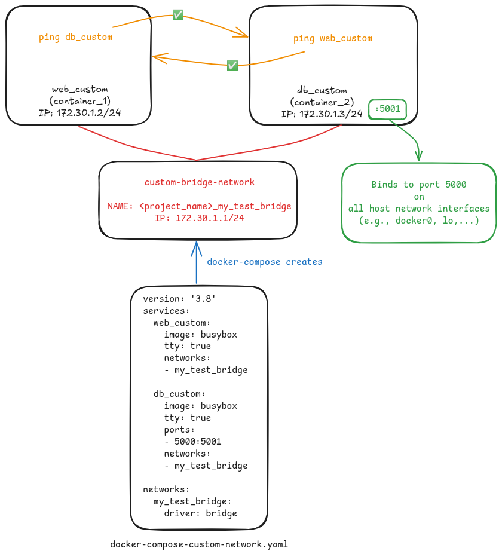

# 🐬 Container Name Discovery

In Docker, one container can access the service running on another container by referring to its container name (aka service name) rather than its IP address (powered by Domain Name Resolution, DNS, provided by Docker).

For example, you have two containers, one called **web** and another called **db**. Inside **web**, you can access the service running on **db** by, for example, `curl db`.

However, as I used it in my job, it has some setting details need to be noticed...

## ⚙️ Setting Details

| Settings | Can Resolve Container Name? | Illustration | Note | Compose Example |
|---------|--------|---------|---------|---------|
| docker compose with NO network settings | ✅ |  | `docker-compose` creates custom bridge network, called `<project_name>_default` | [docker-compose.yaml](./docker-compose.yaml) |
| docker compose with custom network | ✅ |  | Containers use a user-defined custom bridge network | [docker-compose-custom-network.yaml](./docker-compose-custom-network.yaml) |
| docker compose with different networks | ❌ |  | Containers use two different networks | [docker-compose-diff-network.yaml](./docker-compose-diff-network.yaml) |
| docker compose with `network_mode: bridge` | ❌ |  | Containers are bound to `docker0` | [docker-compose-bridge.yaml](./docker-compose-bridge.yaml) |
| docker compose with `network_mode: host` | ❌ |  | Containers share the host network stack | [docker-compose-host.yaml](./docker-compose-host.yaml) |

## 📢 Findings

It seems like **Container Name Discovery** only works on containers running on **the same** custom bridge network.

`docker0` is the default bridge network, not a custom one. Hence, **Container Name Discovery** does not work on it.

## 🌳 Environment

| Software | Versions |
|---------|--------|
| Ubuntu | 20.04.6 LTS |
| docker | 27.3.1, build ce12230 |
| docker-compose | 1.29.2, build 5becea4c |