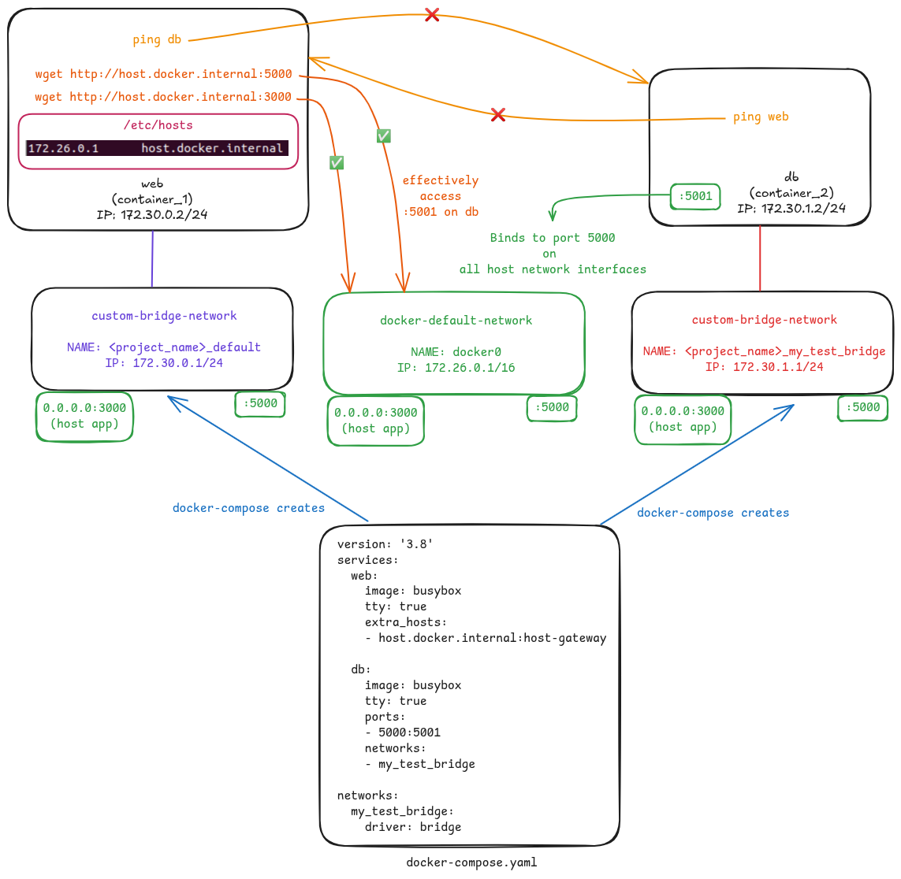

# 🐬 Extra Hosts

Have you ever met the following challenges?

- Two services runs on different docker bridge networks (e.g., one on network A and another on network B), and you want to access one from another?
- A service on a bridge network wants to access a service running on host machine (not running with Docker)?

Docker comes with an option, called `extra_hosts`, as a solution for these needs.

## ⚙️ Setting Details

Adding the following code line under a service definition in a `docker-compose.yaml` asks Docker to add a hostname mapping (`<docker0 IP> host.docker.internal`) to `/etc/hosts`.
```yaml
extra_hosts:
    - host.docker.internal:host-gateway
```
We can later use this hostname to access 
- services running on another containers (with ports bound out)
    - e.g., `wget http://host.docker.internal:5000`
- applications running on host machine (not running with Docker)
    - e.g., `wget http://host.docker.internal:3000`

The whole system is illustrated as below.


Docker compose example file: [docker-compose.yaml](./docker-compose.yaml)

## ⚠️ Be careful

When use the following two options together and there is no internet connection, `sudo` would experience around 15s delay.
```yaml
network_mode: host
extra_hosts:
    - host.docker.internal:host-gateway
```

This is caused by Docker forgets to add `127.0.0.1 <host_user_name>` mapping into `/etc/hosts`. However, it does add `<docker0 IP> host.docker.internal`.

Workarounds:
1. Add the following code line to container init script.
    ```sh
    sudo sh -c 'echo "127.0.1.1\thostname" >> /etc/hosts' 
    # NOTE: in sh, echo does NOT take -e option to escape characters
    ```
2. Do not use the `extra_hosts` option and access services with `0.0.0.0` as domain name.

## 🌳 Environment

| Software | Versions |
|---------|--------|
| Ubuntu | 20.04.6 LTS |
| docker | 27.3.1, build ce12230 |
| docker-compose | 1.29.2, build 5becea4c |